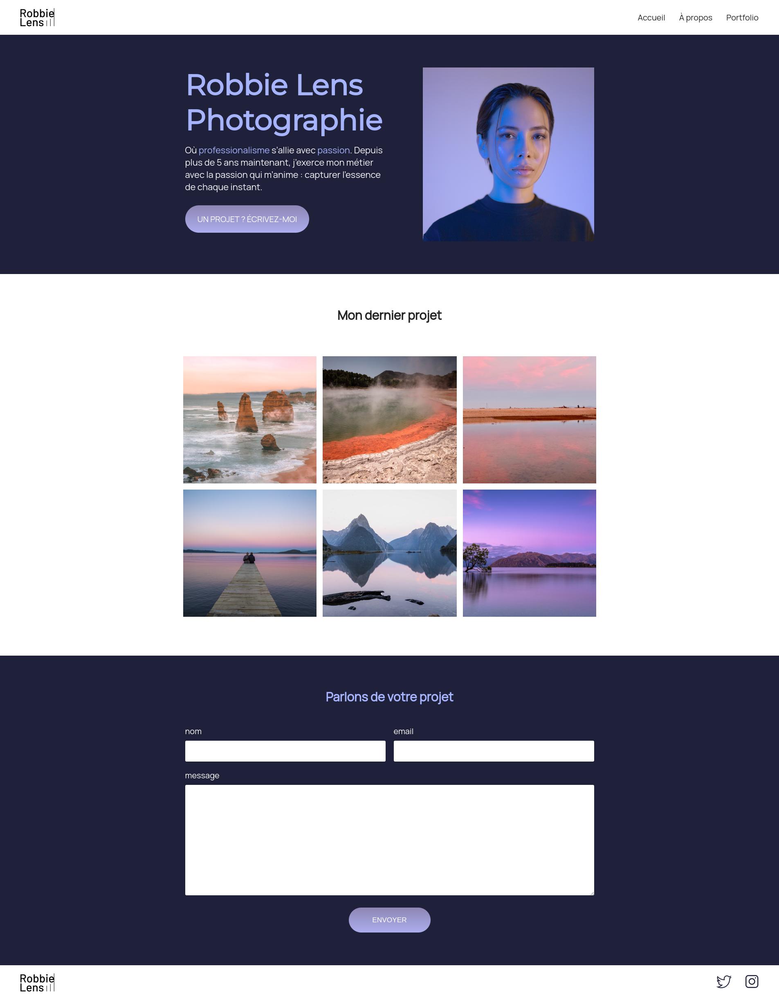
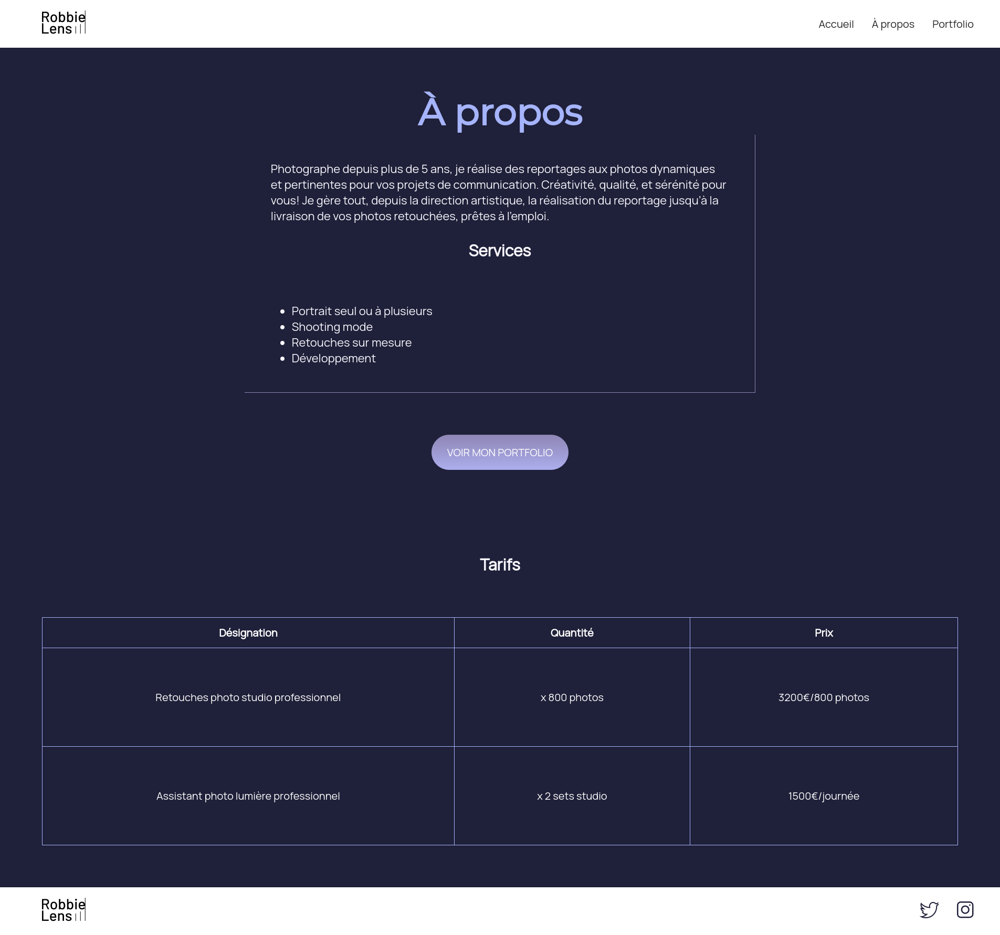
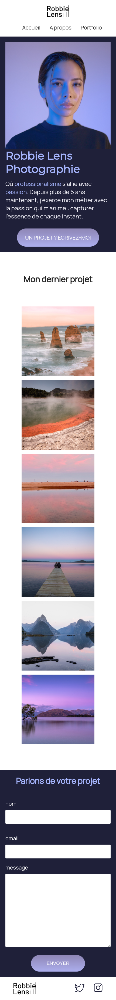
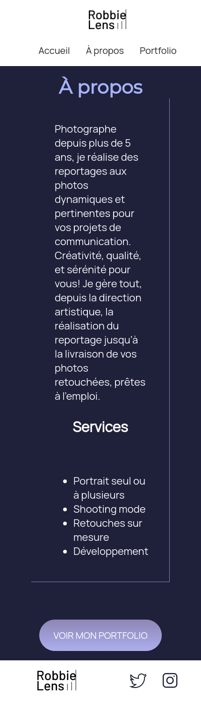
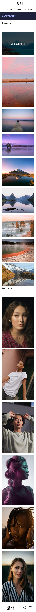

# OC_Website

Like said in the description:
> A website made from this [Openclassrooms tutorial](https://openclassrooms.com/fr/courses/1603881-creez-votre-site-web-avec-html5-et-css3).

## Screenshots

**Normal view:**

> index.html

> a-propos.html

> portfolio.html

---

**Smartphone view:**

> index.html

> a-propos.html

> portfolio.html

